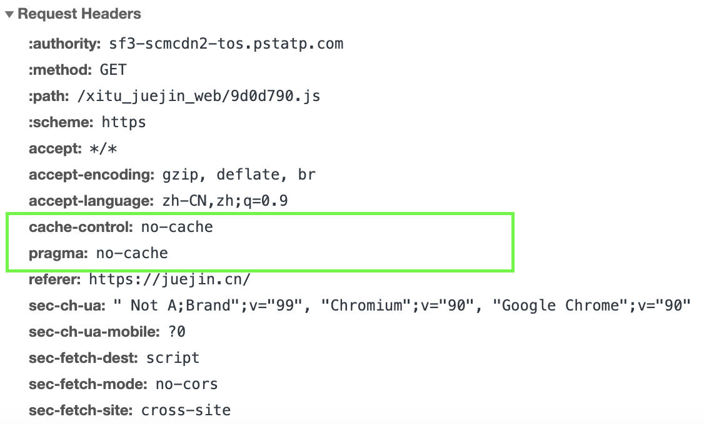
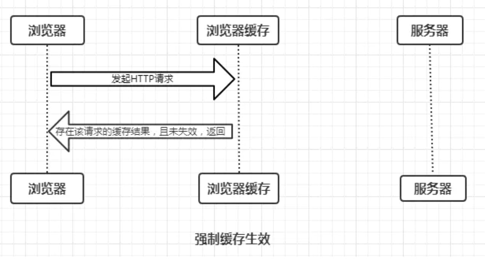

https://zhuanlan.zhihu.com/p/44789005

# 缓存机制

浏览器的缓存机制也就是我们说的HTTP缓存机制；

其机制是根据**HTTP报文的缓存标识**进行的；

# 概念和术语

- **缓存命中率**：从缓存中得到请求数与所有请求数的比率。理想状态是越高越好。
- **过期内容**：超过设置的有效时间，被标记为 '陈旧' 的内容。通常过期内容不能用于回复客户端的请求，必须重新向源服务器请求新的内容或者验证缓存的内容是否仍然可用。
- **验证**：验证缓存中的过期内容是否仍然有效，验证通过的话刷新过期时间或策略。
- **失效**：失效就是把内容从缓存中移除。当内容发生改变时就必须移除失效的内容。

***

1. expires: 告知客户端资源缓存失效的绝对时间
2. last-modified: 资源最后一次修改的时间
3. Etag: 文件的特殊标识
4. cache-control:告诉客户端或是服务器如何处理缓存。
5. private: cache-control里的响应指令.表示客户端可以缓存
6. public: cache-control里的响应指令.表示客户端和代理服务器都可缓存.如果没有明确指定private，则默认为public。
7. no-cache: cache-control里的指令.表示需要可以缓存，但每次用应该去向服务器验证缓存是否可用
8. no-store: cache-control字段里的指令.表示所有内容都不会缓存，强制缓存，对比缓存都不会触发.
9. max-age=xxx: cache-control字段里的指令.表示缓存的内容将在 xxx 秒后失效

# 缓存的作用

通过复用以前获取的资源：

- 减少网络带宽消耗
- 降低服务器压力
- 减少网络延迟，加快页面打开速度

# 限制

然而常见的 HTTP 缓存只能存储 [`GET`](https://developer.mozilla.org/zh-CN/docs/Web/HTTP/Methods/GET) 响应，对于其他类型的响应则无能为力。（一般只有GET请求才会被缓存）

# 浏览器缓存过程🍓

浏览器第一次加载资源，服务器返回200，浏览器将资源文件从服务器上请求下载下来，并把response header及该请求的返回时间一并缓存；

下一次加载资源时，先比较当前时间和上一次返回200时的时间差，如果没有超过cache-control设置的max-age，则没有过期，命中强缓存，不发请求直接从本地缓存读取该文件（如果浏览器不支持HTTP1.1，则用expires判断是否过期）；如果时间过期，则向服务器发送header带有If-None-Match和If-Modified-Since 的请求；

服务器收到请求后，优先比较If-None-Match和Etag的值判断被请求的文件有没有做修改，Etag值一致则没有修改，命中协商缓存，返回304；如果不一致则有改动，直接返回新的资源文件带上新的Etag值并返回 200；

如果服务器收到的请求没有Etag值，则将If-Modified-Since和被请求文件的最后修改时间做比对，一致则命中协商缓存，返回304；不一致则返回新的last-modified和文件并返回 200；

https://mp.weixin.qq.com/s?__biz=MjM5MTA1MjAxMQ==&mid=2651226262&idx=1&sn=2128db200b88479face67ed8e095757c&chksm=bd4959128a3ed0041b43a5683c75c4b88c7d35fac909a59c14b4e9fc11e8d408680b171d2706&scene=21#wechat_redirect

***

用户行为对浏览器缓存的控制

地址栏访问，链接跳转是正常用户行为，将会触发浏览器缓存机制；

F5刷新，浏览器会设置max-age=0，跳过强缓存判断，会进行协商缓存判断；

ctrl+F5刷新，跳过强缓存和协商缓存，直接从服务器拉取资源。

# 第一次请求

第一次请求，浏览器也会访问缓存，此时，缓存中肯定没有需要的资源和缓存标识。浏览器会向目标服务器发送http请求，来获取资源。

如果相应资源的报文中携带缓存标识，浏览器同时会将这个缓存标识和资源存储在缓存内。


**第一次请求**



**第一次响应：**


# 强制缓存

强制缓存(自己强制决定)：

就是向浏览器缓存查找该请求的缓存结果, 

+ 若不存在该缓存结果和缓存标识，强制缓存失效，则直接向服务器发起请求（跟第一次发起请求一致）
+ 有缓存结果和缓存标识,   但是结果已经失效,   强制缓存失效,   则使用协商缓存
+ **缓存中存在缓存结果和缓存标识,   且该结果仍然有效,  强制缓存生效, 直接返回该缓存结果**



## 缓存字段

第一次，浏览器在向服务器发送http请求后，服务器不仅返回结果，还返回相应的缓存字段；

其中涉及强制缓存的字段分别是**Expires**和**Cache-Control**，其中**Cache-Control优先级比Expires高。**

强缓存响应：


***

区别：

+ Expires是HTTP/1.0的字段； Cache-contro是HTTP/1.1的字段;

+ Expires是绝对时间： 表示该资源缓存的到期时间；

+ Cache-control: 是相对时间，表示在多少秒之后，资源缓存过期；

+ Expires已经被cache-control取代，原因在于Expires控制缓存的*原理是使用客户端的时间与服务端返回的时间做对比*，那么如果客户端时间不准确或被修改，那么强制缓存则会直接失效，这样的话强制缓存的存在则毫无意义。

+ Cache-Control的取值： public、 private、no-cache、no-store、**max-age=xxx (xxx is numeric)：缓存内容将在xxx秒后失效**, 在xxx秒内再次发起该请求，则会直接使用缓存结果，强制缓存生效。
  
  + max-age： 表示资源能够被缓存（保持新鲜）的最大时间。
  
  + no-store (所有内容都不会被缓存，即不使用强制缓存，也不使用协商缓存)
  + no-cache (客户端缓存内容，但是是否使用缓存则需要经过协商缓存来验证决定)


## 强缓存在浏览器上的表现


- Firefox浏览器对强缓存表现为一个**灰色的200状态码**。
- Chrome浏览器灰色状态码表现为:`200 (from disk cache)或是200 OK (from memory cache)`

说明: Chrome会根据本地内存的使用率来决定缓存存放在哪，**如果内存使用率很高，放在磁盘里面；如果磁盘的使用率很高，会暂时放在内存里面**。这就可以比较合理的解释了为什么同一个资源有时是from memory cache有时是from disk cache的问题了。

## 为什么会有协商缓存？

但是强制缓存存在一个问题，该缓存方式优先级高，如果在过期时间内缓存的资源在服务器上更新了，客服端不能及时获取最新的资源。这时怎么办? 于是就有了协商缓存.

# 协商缓存

*缓存协商策略用于重新验证缓存资源是否有效*

协商缓存就是强制缓存失效后，浏览器携带缓存标识向服务器发起请求，由服务器决定是否仍然使用缓存的过程。


1， 浏览器向缓存发起请求后，若缓存中存在缓存结果（资源）和缓存标识，但缓存结果已经失效了，

2，此时，浏览器会携带该缓存标识，向服务器发送请求，来验证失效的缓存结果是否仍然可用（是否有修改）

3， **若验证通过**（即失效的的资源仍然可用，如上图），则服务器会发送一条响应告知浏览器缓存可用，响应码为304，响应报文中不包含主体数据（即响应中不返回结果）。  ----->>>     浏览收到响应后，会直接从缓存中获取缓存结果。

​	响应报文中，含有新的过期时间，浏览器会根据这个时间刷新本地缓存中的缓存标识？？？？？？

4，**若验证不通过，如下图**：服务器发送响应返回新的资源，响应码是200， 响应报文中有主体数据，


## Last-Modified (响应) / If-Modified-Since


Last-Modified： 是服务器响应请求时，返回该**资源在服务器最后被修改的时间**

Last-Modified是该资源文件最后一次更改时间，服务器会在response header里返回，同时浏览器会将这个值保存起来;

在下一次发送请求时，放到request header里的If-Modified-Since里，服务器在接收到后也会做比对，如果相同则命中协商缓存。


## Etag (响应) / If-None-Match

Etag是上一次加载资源时，服务器返回的response header，是对该资源的一种唯一标识，只要资源有变化，Etag就会重新生成。

If-None-Match： 浏览器在下一次加载资源向服务器发送请求时，会将上一次返回的Etag值放到request header里的If-None-Match里，服务器接受到If-None-Match的值后，会拿来跟该资源文件的Etag值做比较，如果相同，则表示资源文件没有发生改变，命中协商缓存, 返回304。

## 区别：Etag vs Last-Modified

**注：Etag / If-None-Match优先级高于Last-Modified / If-Modified-Since，同时存在则只有Etag / If-None-Match生效。**

首先在精确度上，Etag要优于Last-Modified。Last-Modified的时间单位是秒，如果某个文件在1秒内改变了多次，那么他们的Last-Modified其实并没有体现出来修改，但是Etag每次都会改变确保了精度；如果是负载均衡的服务器，各个服务器生成的Last-Modified也有可能不一致。

第二在性能上，Etag要逊于Last-Modified，毕竟Last-Modified只需要记录时间，而Etag需要服务器通过算法来计算出一个hash值。

第三在优先级上，服务器校验优先考虑Etag。

# 启发式缓存算法

如果Expires, Cache-Control: max-age, 或 Cache-Control:s-maxage 都没有在响应头中出现, 并且也没有其它缓存的设置, 那么浏览器默认会采用一个启发式的算法, 通常会取响应头的Dat - Last-Modified值的10%作为缓存时间.

https://mp.weixin.qq.com/s?__biz=MjM5MTA1MjAxMQ==&mid=2651226347&idx=1&sn=6dbccc54406f0b075671884b738b1e88&chksm=bd49596f8a3ed079f79cda4b90ac3cb3b1dbdb5bfb8aade962a16a323563bf26a0c75b0a5d7b&scene=21#wechat_redirect

启发式缓存算法采用的缓存时间可长可短, 因此对于常规资源, 建议明确设置缓存时间(如指定max-age 或 expires).


# 综述

在 Header 内的字段用于控制缓存机制 

老方法 Expires，记录的绝对值 

新方法 Cache-Control 多了一堆选项，记录的时间是相对值

 获取缓存检测缓存是否过期，如果没过期取缓存，优先从内存，其次硬盘，

如果过期，则与服务器协商缓存是否仍然可用，如果不可用则获取，可用取缓存。

***

+ 强制缓存优先于协商缓存进行，

+ 若强制缓存(Expires和Cache-Control)生效则直接使用缓存，若不生效则进行协商缓存(Last-Modified / If-Modified-Since和Etag / If-None-Match)，
+ 协商缓存由服务器决定是否使用缓存（由服务器验证），
  + 若协商缓存*失效*，那么代表该请求的缓存失效，重新获取请求结果（200），再存入浏览器缓存中；
  + 协商缓存*生效*则返回304，继续使用缓存，主要过程如下：


# 链接

https://blog.csdn.net/qq_41800649/article/details/108941774

https://juejin.cn/post/6844903781084184584

https://juejin.cn/post/6844903981395755015

https://developer.mozilla.org/zh-CN/docs/Web/HTTP/Caching#%E7%BC%93%E5%AD%98%E6%8E%A7%E5%88%B6

# 其他问题

**1， 浏览器每次发起请求，都会先在浏览器缓存中查找该请求的结果以及缓存标识？**

是的

**2, Age**

出现此字段, 表示命中代理服务器的缓存. 

它指的是代理服务器对于请求资源的已缓存时间, 单位为秒. 如下:

```
Age:2383321
```

**3, Date**

指的是响应生成的时间

**4, Vary**

对于服务器而言, 资源文件可能不止一个版本, 比如说压缩和未压缩, 针对不同的客户端, 通常需要返回不同的资源版本. 

那么怎么区分这个版本呢, 这个时候就需要Vary了.

服务器通过指定Vary: Accept-Encoding, 告知代理服务器, 对于这个资源, 需要缓存两个版本: 压缩和未压缩. 

这样老式浏览器和新的浏览器, 通过代理, 就分别拿到了未压缩和压缩版本的资源, 避免了都拿同一个资源的尴尬 .

```
Vary:Accept-Encoding,User-Agent
```

如上设置, 代理服务器将针对是否压缩和浏览器类型两个维度去缓存资源. 如此一来, 同一个url, 就能针对PC和Mobile返回不同的缓存内容.

**5， 304的响应头也可以同时更新缓存文档的过期时间。**


