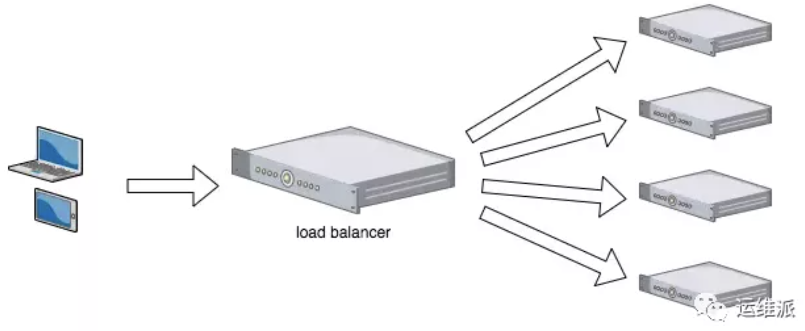

SLB（服务器负载均衡）（server Load Balancer）

Nginx系列教程（三）| 一文带你读懂Nginx的负载均衡 https://mp.weixin.qq.com/s?__biz=MzAwMjg1NjY3Nw==&mid=2247488847&idx=1&sn=b97ab2bc6880c6136d924224b791b792&scene=21#wechat_redirect

# 定义

负载均衡**本质**： 将用户流量进行均衡减压，因此在互联网的大流量项目中，很重要。

**定义1：**： 负载均衡是指把用户访问流量，通过【负载均衡器】，根据某种转发的策略，均匀的分发到后台的多台服务器上，后端的服务器可以独立的处理请求并响应，从而实现流量分散负载的效果。

**定义2:**  将用户的请求，分发到集群中不同的机器上呢，这就是负载均衡在做的事情。

# 各种IP地址

**下面的IP地址术语： 是LVS模型中的常见专用术语**

见： https://mp.weixin.qq.com/s?src=11&timestamp=1626617597&ver=3198&signature=zg6pcVE*tZbL828EmMYaK6M9KdzqQN2RC16Y4*IKPq8WjifOa*Ub1*Ul0bY57K*osJp-1-*3VnHiEtd5Mic*5HelUCWWv8pa-LWEThjHXPfAw2xDu1PoXl3ImBriupCi&new=1

***

*对客户端看到的而言，RS（real server 实际服务器）的IP地址即是绑定负载均衡设备的虚拟IP地址（VIP），真正的RS服务器IP地址对于客户端是不可见的。*

+ RIP： 实际服务器的ip地址（也就是实际提供数据的服务器地址）
+ DIP： 负载均衡设备的ip地址
+ VIP： 虚拟服务地址（Virtual IP）：向外部直接面向用户请求，作为用户请求的目标的IP地址。
+ CIP： client ip， 客户端的地址

## 虚拟IP

只有2层，3层负载均衡中，存在VIP？

***

负载均衡服务器对外依然提供一个VIP（虚IP）

***

VIP虽然名字上叫虚拟IP，却是实打实存在的一个IP，**这个VIP同时绑定在负载均衡设备上和提供服务的Real Server上**，但只有负载均衡设备响应这个vip的arp请求，RS接受处理该ip的报文，并不影响arp，这样就不会完成ip冲突。

当用户的请求来到时，交换机会发起arp，负载均衡器响应arp，则交换机记录该ip是属于负载均衡器的，把该ip的报文都交给负载均衡器处理，负载均衡器根据转发规则将报文转给实际的业务real server。

(也就是说客户端和虚拟ip通信；负载均衡器和RS通信 )
链接：https://www.zhihu.com/question/67682565/answer/255631744

***

虚拟IP和负载均衡：

我们知道一般的IP地址是和物理网卡绑定的，而VIP相反，是不与实际网卡绑定的的IP地址。

当外网的上的一个机器，通过域名访问某公司内网资源时，内网的DNS服务器会把域名解析到一个VIP上。

当外网主机得到这个VIP后，就将数据包发往这个VIP。但是在内网中，这个VIP是不与具体的设备相连接的，所以外网发过来数据包，究竟会到哪台机器（RS）呢？

其实，这个在内网的过程是，通过ARP协议来完成的。也就是说这个VIP可以映射到的MAC地址是可以控制的。

**VIP在内网中被动态的映射到不同的MAC地址上，也就是映射到不同的机器设备上（RS），那么就可以起到负载均衡的效果啦。**

>PS:VIP的概念的是LVS中一个概念，具体学习《Linux负载均衡软件LVS之概念篇》http://blog.csdn.net/wangjianno2/article/details/21291209
>
>原文地址：http://www.voidcn.com/article/p-rvygijjc-bhh.html

## arp：地址解析协议

是根据IP地址获取物理地址的一个TCP/IP协议。

# 负载均衡类型：3种

1，基于DNS的负载均衡： 主要实现**地域**上的流量均衡；

2，基于硬件的负载均衡： 主要用于大型服务器集群中的负载均衡；

3，基于软件的负载均衡： 大多是基于机器层面的流量均衡；

## 1，基于DNS负载均衡

+ 是最简单的实现方案：通过在DNS服务器上做一个简单配置即可。

+ **原理：DNS服务器对同一个域名，配置了多个IP。同一个域名，通过轮询方式，会被解析为不同的IP地址。**

  当用户访问域名的时候，DNS服务器会先根据域名解析出对应的IP地址，这个时候，可以让DNS服务器根据用户*不同的地理位置*，从而返回不同的IP。例如，南方的用户就返回在广州的业务服务器的IP，北方用户的话，就返回北京业务服务器所在的IP。

+ 在这个模式下，相当于实现了用户**就近原则**，将请求分流了。

+ **优点**：既减轻了单个集群的压力，也提升了用户的访问速度。且配置简单，实现成本低。

+ **缺点**： 当配置修改后，生效不及时。这是由于DNS的缓存特性导致的。

  + DNS一般会有多级缓存，当我们修改了DNS配置后，由于缓存的原因，会导致IP变更不及时，从而影响负载均衡的效果。

  另一个缺点是：策略简单，一般就是基于地域或者干脆直接做IP轮询，没有更高级的策略。

***

像 BAT 体量的公司一般会利用 DNS 来实现地理级别的全局负载均衡，实现就近访问，提高访问速度，这种方式一般是入口流量的基础负载均衡，下层会有更专业的负载均衡设备实现的负载架构。

## 2， 基于硬件的负载均衡

https://www.jianshu.com/p/69340b4f5652

F5

硬件的负载均衡那就比较牛逼了，比如大名鼎鼎的 F5 Network Big-IP，也就是我们常说的 F5，它是一个网络设备，你可以简单的理解成类似于网络交换机的东西，完全通过硬件来抗压力，性能是非常的好，每秒能处理的请求数达到百万级，即 几百万/秒 的负载，当然价格也就非常非常贵了，十几万到上百万人民币都有。

因为这类设备一般用在大型互联网公司的流量入口最前端，以及政府、国企等不缺钱企业会去使用。一般的中小公司是不舍得用的。

采用 F5 这类硬件做负载均衡的话，**主要就是省心省事，买一台就搞定，性能强大**，一般的业务不在话下。

而且在负载均衡的算法方面还支持很多灵活的策略，同时还具有一些防火墙等安全功能。*但是缺点也很明显，一个字：贵。*

## 3， 基于软件负载均衡

软件负载均衡：是指使用软件的方式，来分发和均衡流量。

**软件负载均衡，分为7层协议和4层协议**

（网络协议有七层）

**4层负载均衡：** 基于第四层（传输层）来做流量分发，例如 LVS（Linux Virtual Server = Linux虚拟服务器）

**7层负载均衡：** 基于第七层（应用层）来做流量分发，例如 Nginx。

区别：

+ 4层的性能要高一些，一般能达到 几十万/秒 的处理量，
+ 而7层的负载均衡处理量一般只在 几万/秒 

*基于软件负载均衡优点和缺点：*

优点：便宜；在正常的服务器上部署即可，无需额外采购，就是投入一点技术去优化优化即可，因此这种方式是互联网公司中用得最多的一种方式。

# 负载均衡设备

`负载均衡设备`也常被称为"`四到七层交换机`"

***

在实际应用中，在Web服务器集群之前总会有一台负载均衡服务器，*负载均衡设备的任务*就是作为流量的入口，挑选最合适的一台服务器，将客户端的请求转发给它处理，实现客户端到真实服务端的透明转发。

客户端不需要关心真正提供服务的是哪台机器，在它看来，就好像它面对的是一台拥有近乎无限能力的服务器，而本质上，真正提供服务的是后端的集群。

# 负载均衡的三种传输模式

 一文详解负载均衡和反向代理的真实区别 https://mp.weixin.qq.com/s/TYM83F2O-keMvn4ZYa5nqw

在负载均衡设备中，SLB主要工作在以下的三种传输模式中：

- 反向代理模式
- 透传模式
- 三角模式

根据不同的模式，负载均衡设备的工作方式也不尽相同，但无论在哪种模式下，客户端发起的请求报文总是需要先到达负载均衡设备进行处理，这是负载均衡设备正常工作的前提。

***

前提：模拟网络拓扑环境：

- Client （CIP）：10.8.21.40
- 负载均衡设备（DIP）：172.16.75.83
- VIP：172.16.75.84
- RS1IP：172.16.75.82
- RS2IP：172.16.75.85

## 反向代理模式

在反向代理模式下：

当负载均衡设备收到客户端请求后，会记录下此报文（ 源IP地址、目的IP地址、协议号、源端口、目的端口，服务类型以及接口索引），将报文目的地址更改为优选后的RS设备的IP地址，目的端口号不变，源地址修改为负载均衡的IP地址，源端口号随机发送给RS；

当RS收到报文后，会以RIP为源IP，DIP为目的IP，回复给负载均衡设备，负载均衡设备将源IP再次修改为VIP，将目的IP修改为Client的IP，并回复报文。

***

分析整个报文交互过程：

1，TCP握手过程：首先Client向负载均衡设备发送TCP SYN报文，请求建立连接，源IP为Client的IP ( 10.8.21.40)，源端口号50894，目的IP为VIP地址（172.16.75.84），目的端口号80；

2， 收到请求报文后，负载均衡设备，会将VIP（172.16.75.84）作为源IP，源端口号80，将CIP（10.8.21.40）作为目的IP ，目的端口号50894，回应一条SYN ACK报文；

3， Client收到报文后回复ACK报文，**TCP三次握手成功。**

*HTTP报文交互过程：*

4，因为配置的是七层SLB，所以当负载均衡设备与client完成三次握手，并*收到HTTP请求*后，就会根据负载均衡算法和服务器健康状态优选出对应的RS（在这次过程中选择的RS设备为172.16.75.82），然后再与RS建立TCP连接（仍然有3次握手）：

5，负载均衡设备发送 TCP SYN 报文请求连接，源IP为负载均衡设备与RS相连接口IP 172.16.75.83（DIP），源端口号随机4574，目的IP为RS的IP（RIP） 172.16.75.82，目的端口号80；

6，RS 收到报文后，以RIP（172.16.75.82）为源IP ，端口号80，以DIP（ 172.16.75.83）为目的IP，目的端口号4574，回复SYN ACK报文

7， 负载均衡设备回复ACK报文建立三次握手；

8，之后，负载均衡设备再将收到的HTTP报文，源IP修改为DIP（172.16.75.83），源端口号为随机端口号；将报文发送给RS；

9，当RS收到报文后，使用本地的RIP为源IP（ 172.16.75.82），目的IP为（DIP）172.16.75.83进行回复，**所以报文直接回复给负载均衡设备；**

10，当负载均衡设备收到RS的回应报文后，将报文的源地址修改为VIP地址172.16.75.84，目的地址设为客户端地址（10.8.21.40）发送回 Client，再将目的端口号修改为HTTP请求报文中的源端口号，服务器访问成功。

由上述的过程可以看出，在RS端上，client的真实IP地址被负载设备修改成与RS相连接口的IP地址（也就是DIP），所以RS无法记录到Client的访问记录，**为了解决这个问题，可以采用在HTTP报文头中添加X-Forwarded-For字段**，本文不做赘述，可以自行查询。

## 透传模式

**当负载均衡设备工作在透传模式中时，RS无法感知到负载均衡设备的存在**

在这种模式下，当负载均衡设备收到源IP为CIP，目的 IP 为本VIP 的报文时，会将报文发送给最优的 RS ，继而RS会收到目的IP为本IP，源IP为CIP的请求报文；

然后RS将会直接回应此请求，响应报文的目的 IP 为 CIP，当负载均衡设备收到此报文后，将源 IP 修改为 VIP 地址，然后将报文发送给 Client。

​		CIP -> VIP | CIP -> RIP

​        CIP <- VIP | CIP <- RIP	

## 三角模式

在三角模式下，当客户端发送请求到负载设备上时，负载均衡设备会计算出最优RS，然后直接根据MAC地址将报文转发给RS，在RS上配置报文的源IP为VIP地址（一般配置在loopback口上），因此在这种情况下，**RS会直接将报文发送给Client，即使回复报文经过负载均衡设备，此设备不做任何处理。**

由于报文在整个过程中传输途径类似于三角形，因此称之为三角模式。

**在三角模式中，由于回复报文负载均衡设备不做任何处理，所以非常适合于RS到Client方向流量较大或者连接数目较多的组网环境。**

采用三角模式时，必须注意RS有路由可以到达Client，并且在RS的Loopback接口上必须有负载均衡设备的VIP地址，否则即使RS设备收到Client的请求报文也会直接丢弃报文，不作回应。

## 总结

由于反向代理模式中在RS侧，只能收到源为负载均衡设备IP的报文，因此可以使用防火墙增加安全性，只允许源IP为负载均衡设备的IP地址的报文通过，同时增加X-Forwarded-For字段，也可以让RS只允许有此字段的报文进行访问，因此安全性相对较高。

|              | 是否更改源IP | 优点                                                     | 缺点                                           | 适用场景                           |
| ------------ | ------------ | -------------------------------------------------------- | ---------------------------------------------- | ---------------------------------- |
| 反向代理模式 | 是           | 客户端和真实服务器之间，完全由负载均衡设备隔离，安全性高 | 会出现端口 耗尽的情况？                        | 根据客户要求，适用于大部分场景     |
| 透传模式     | 否           | RS可以直接记录客户端的访问信息，不易出现端口耗尽？       | 当客户端和服务器处于同一网段时，不能采用此模式 | 根据客户要求，同样适用于大部分场景 |
| 三角模式     | 否           | 负载设备压力最小，网络响应速度最快                       | 只支持IP、TCP、UDP类型的虚拟服务器             | 适用于服务器侧流量连接大的网络     |

# 负载均衡分层

https://developer.aliyun.com/article/507416?spm=a2c6h.17698244.wenzhang.5.134211daJd9MbX

**4层负载均衡：** 基于第四层（传输层）来做流量分发，例如 LVS，

**7层负载均衡：** 基于第七层（应用层）来做流量分发，例如 Nginx。

## 2层

负载均衡服务器对外依然提供一个VIP（虚IP），集群中不同的机器采用相同IP地址，但机器的MAC地址不一样。

当负载均衡服务器接受到请求之后，通过改写报文的目标MAC地址的方式将请求转发到目标机器实现负载均衡。

## 3层

和二层负载均衡类似，负载均衡服务器对外依然提供一个VIP（虚IP），但集群中不同的机器采用不同的IP地址。当负载均衡服务器接受到请求之后，根据不同的负载均衡算法，通过IP将请求转发至不同的真实服务器。

## 4层

四层工作在传输层；

由于在传输层，只有TCP/UDP协议，这两种协议中除了包含源IP、目标IP以外，还包含源端口号及目的端口号。

所以，四层负载均衡服务器在接受到客户端请求后，以后通过修改数据包的地址信息（IP+端口号）将流量转发到各个应用服务器。

**LVS使用的是4层负载均衡**

## 7层

七层负载均衡工作应用层，应用层协议较多，常用http、radius、DNS等。七层负载就可以基于这些协议来负载。

对于一般的应用来说，有了Nginx就够了。**Nginx可以用于七层负载均衡**。

但是对于一些大的网站，一般会采用DNS+四层负载+七层负载的方式进行*多层次负载均衡。*

## 四层和七层的区别

https://developer.aliyun.com/article/62902?spm=a2c6h.14164896.0.0.104a741b6m0kZz

### 第一，技术原理上的区别。

四层负载均衡： TCP的连接建立，即三次握手是客户端和后端服务器直接建立的

七层负载均衡：负载均衡和前端的客户端、以及后端的服务器，会分别建立TCP连接（2个三次握手）

### 第二，应用场景的需求

# 负载均衡算法

 常用的均衡算法有哪些？

1，轮询策略 （简单轮询 = Round Robin、加权轮询 = Weighted Round Robin）

2，负载度策略

3，响应策略

4，哈希策略

## 随机

【请求随机分布到各个结点；在数据足够大的场景能达到一个均衡分布；】

特点： Random 随机。  这是最简单的一种，使用随机数来决定转发到哪台机器上。

优点：简单，不需要额外的配置和算法。

 缺点：随机数的特点是在数据量大到一定量时才能保证均衡，所以如果请求量有限的话，可能会达不到均衡负载的要求。

## 简单轮询

特点：  这个也比较简单，**请求到达后，依次转发到各个服务器，不偏不向**。每个服务器的请求数量很平均。

缺点：当集群中服务器硬件配置不同、性能差别大时，无法区别对待。引出下面的算法： 加权轮询。

## 加权轮询

这种算法的出现就是为了解决【简单轮询算法】中的不足。

在实际项目中，经常会遇到这样的情况：

*比如有5台机器，两台新买入的机器，性能等各方面都特别好，剩下三台老古董，性能较差。这时候我们设置一个权重，让新机器接收更多的请求。物尽其用、能者多劳嘛！*

**能者多劳**

## 最少连接 （Least Connections）

**这是最符合负载均衡算法的一个**。

需要记录每个应用服务器正在处理的连接数，然后将新来的请求转发到最少的那台服务器上。

## 源地址散列=Hash法（Source Hashing）

 最常用的，是根据请求的ip进行hash计算，然后对应到一个服务器上。之后所有来自这个ip的请求都由同一台服务器处理。

这样可以确保相同的客户端请求，尽可能落在同一台服务器上。

## 负载度策略

# Nginx和负载均衡

Nginx实现负载均衡： 属于软件负载均衡、7层负载均衡

## nginx实现负载均衡的作用

- `转发功能`：Nginx 会按照一定的算法轮询、权重将客户端发来的请求转发至不同的应用服务器上，同时减轻单台服务器的压力，提高服务器的并发量；
- `故障迁移`：当一台服务器出现了故障时，客户端发来的请求将自动发送到其他服务器；
- `添加恢复`：当故障服务器恢复正常工作时，将自动添加到处理用户请求中；

# 名词解释

## 扩容

https://mp.weixin.qq.com/s?src=11&timestamp=1626603890&ver=3198&signature=kx2DeBNPBsbaX6MNNEDAVVbAzIQz6xNJC2NGN-a1rDsw2VMc74Gy0VZYhveax0ereOpJsbcKpZfHA9R1V5xRD*o9Y-ywUj8WwVKIOfKBCOyamTaEWwvC-Cved9hMZ4u9&new=1

在网站创立初期，我们一般都使用单台机器对外提供集中式服务，这样对于小型的业务访问量是完全可以的。

但随着业务量越来越大，无论性能还是稳定性上都有了更大的挑战。这时候我们就会想到通过**扩容**的方式来提供更快更好的服务。

## 集群(Cluster)

我们一般会把多台机器组成一个集群，联合起来，对外提供服务。

可以是并行的，也可以是做备份（主服务器，备份服务器们 （集群））。

特点：

**(1)高可靠性(HA)**

**(2)高性能计算(HP)**

**(3)负载平衡(LB)**

***

当前大多数的互联网系统都使用了*服务器集群技术*，*集群： 将相同服务部署在多台服务器上，构成一个集群整体对外提供服务*，这些集群可以是Web应用服务器集群，也可以是数据库服务器集群，还可以是分布式缓存服务器集群等。

## 网络分层

1. 应用层：提供程序之间的通信，常见协议有HTTP、FTP
2. 表示层：处理数据格式、数据加密等，常见协议有NBSSL、LPP
3. 会话层：建立、维护、管理回话，常见协议有RPC、LDAP
4. 传输层：建立计算机之间端到端的联系，常见的协议有TCP、UDP
5. 网络层：寻址和路由选择，IP、ICMP
6. 数据链路层：提供介质访问和链路管理等功能，常见协议有PPP
7. 物理层：进行比特流传输

# 参考

https://book.douban.com/subject/10573157/

https://zhuanlan.zhihu.com/p/56299238