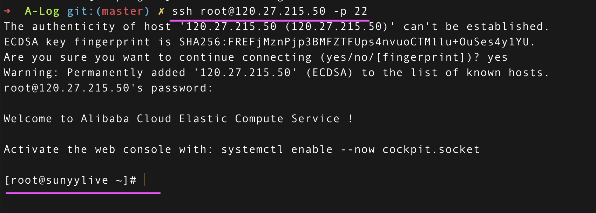

https://tsejx.github.io/devops-guidebook/server/nginx/static-resource-server/ nginx book 🍓🍓🍓🍓🍓

[Apache和Nginx的区别](https://www.cnblogs.com/wangzhipeng/p/7850717.html)

(https://help.aliyun.com/document_detail/97251.html?spm=5176.2020520101.help.dexternal.105e4df5i2715x) 阿里云安装nginx文档

https://blog.csdn.net/Kevinblant/article/details/103168451 新手第一次部署前端项目到阿里云服务器详细步骤（CentOS系统）

 阿里云Centos系统下部署静态前端页面 https://m.tqwba.com/x_d/jishu/352693.html

# 0，前言

前两天自己买了百度云服务器和域名，然后写了一个静态的网页，准备把这个静态的网页放到服务器上去，这样的话，任何人输入网址，都可以看到我写的这个静态网页；于是这两天一直在研究这东西要怎么做才能实现

以前没怎么接触过服务器知识，对于服务器，代理，端口，Nginx,XShell是什么东东，是干什么的,可以说几乎没有认识

http://www.cxyzjd.com/article/Johnisjohn/78633305

**什么是服务器?**

   【1】 就是一台电脑，这台电脑的操作系统一般是Linux/Unix系统的

   【2】 正如我们的个人电脑要安装一些软件一样，服务器电脑也要安装一些软件，我们的个人电脑上(比如win7)可以安装mySQL数据库，在服务器电脑上也可以安装mySQL数据库；区别是啥？区别是：用win7安装的话，很直观很爽，就是鼠标点击界面，点点点，就行了，安装过程你是全程参与操控的，很清楚很直观；可是用服务器安装的话，就有差别了，就要用命令行了，在一个黑框框里面去敲命令，这些命令往往很简洁，但是威力无穷，好像孤独寂寞又身怀绝技的超俗侠客，黑暗之中忽见刀光一闪，霎时间对方人头落地，可谓社会我Linux/Unix哥，人狠话不多。

**二、服务器干啥的？**

   【1】好比说你写好了一个很简单的静态页面test.html,存在你个人电脑的桌面上，好，那么你要想让所有的人都看到你的这个页面，该怎么办呢，肯定要把这个test.html这页面放到一个大家都能看到的地方，如果只在你的D盘里待着，那别人永远看不到这个网页。好，那把这个test.html放到哪里好呢？你在朝阳区，我在海淀区，隔得挺远，可是一抬头，豁，好家伙，都能看到一朵七彩祥云(雾霾天不算哈)，因为七彩云在天上，所以我们都能看到好，好了，那我们就把test.html这个页面放到天上去。想象天上有一台服务器电脑。我们只需要把test.html传送到天上的服务器电脑里的某个位置就可以了，这样的话，因为服务器电脑在天上，所以大家都能看到，想要看test.html这个界面的人只需要从天上下载就可以了。大概就是这么个意思，*服务器电脑是存储这个页面的场所*。

**三、怎么控制服务器？**

   【1】好家伙，真牛逼，服务器都上了天了，那我可怎么控制啊?太远了够不着啊？没关系，有很多工具，比如说*XShell*吧,这是一款终端模拟软件，你只需要下载这个东东到自己的个人电脑上，然后输入服务器电脑的用户名和密码，就可以连接到天上那台服务器电脑并且完全地控制它，这样你就可以远程控制服务器电脑了，运筹帷幄之中决胜千里之外，十万军中取上将首级如探囊取物，皆因你用服务器电脑的用户名和密码取得了它的控制权，从此大权在握垂帘听政做幕后老板一发不可收拾；

**四、服务器电脑上要安装什么？**

*【1】要给服务器电脑，安装Nginx, 注意是安到服务器电脑上去哦，而不是自己个人的电脑哦。*

怎么安装nginx？用XShell就可以控制服务器电脑，所以我们坐在家里，通过XShell这个工具，来给天上的服务器电脑装软件；

怎么使用XShell自己去查资料有很多，如果你的服务器是Ubuntu的，那么在XShell里面输入 apt-get install nginx就行了(当然还有其他的方法),如果你的服务器是CentOS的，那就用yum -xxx???具体命令忘了，自己查资料吧，注意一下，自己的系统是哪一种（虽然都属于Linux系统这个祖宗，但是Ubuntu和CentOS是两个个性有差别的后代），注意别写错了命令，比如在ubuntu里面敲yum ...准备去安装软件，那海枯石烂也不行，收手吧。

*【2】在服务器电脑上安装好Nginx以后，需要配置一下，也就是修改有关Nginx的一些代码*

*【3】配置好nginx以后可能需要启动Nginx这个软件*


# 1. 选择服务器系统

首先刚买了服务器，需要选系统，我选的是CentOS 7.2的Linux系统（大神都是使用的Linux，我不是大神，就跟风一下下）。

点击进入我的控制台 > 云服务 > 实例 > 可以查看到当前服务器状态及**公网IP（这个就是你的服务器对外的IP地址了）。**

([关于公网IP和私有IP的区别](https://blog.csdn.net/ran_Max/article/details/81177069)) 

公网ip：120.27.215.50

# 2. 配置安全组

需要配置一下安全组，否则到时候使用公网IP访问的时候，会出现访问不到的情况。
安全组 > 创建安全组

配置完列表，必须要有80、22端口

# 3, 设置服务器密码

要远程连接到你的阿里云服务器，需要先修改user的登录密码：进入实例 > 管理 > 重置实例密码为SYY152909.

修改后一定要重启服务器；

用户名：root； 密码：SYY152909.

# 4, 使用密码进行 SSH 连接

~~~
ssh root@120.27.215.50 -p 22
~~~




## 执行简单的命令

~~~bash
df -h  # 查看某台主机上的磁盘使用情况

systemctl status firewalld # 查看防火墙状态
systemctl stop firewalld # 临时关闭防火墙
systemctl disable firewalld # 永久关闭防火墙
 
~~~

# 5, 安装Nginx

**为什么需要安装nginx？**

服务器已经连接了，但是现在服务器什么都没有，现在想要往服务器上面放静态资源，像html等等，需要安装静态资源服务器，有Apache和Nginx。

现在你的服务器可以被访问了，但是你想访问服务器上的文件，还需要安装、配置Nginx服务器。


***

1. 运行以下命令，安装Nginx。

   ```bash
   yum -y install nginx
   ```

2, 运行以下命令，查看Nginx版本。

```bash
nginx -v # 返回结果如下所示，表示Nginx安装成功
```

# 6，配置Nginx

*1， 备份nginx的默认配置文件。*

```bash
cat /etc/nginx/nginx.conf # 查看文件内容: $ cat filename

cp /etc/nginx/nginx.conf /etc/nginx/nginx.conf.bak # 备份；# cp（copy file）命令主要用于复制文件或目录
```

*2，修改Nginx配置文件*

​	2.1: 打开Nginx配置文件

~~~bash
vim /etc/nginx/nginx.conf # 打开或新建文件 vim filename

# vim /etc/nginx/conf.d/extra.conf
~~~

​	2.2: 按i进入编辑模式

​	2.3: 在`server`大括号内，修改或添加下列配置信息：

~~~nginx
 				#除下面提及的需要添加的配置信息外，其他配置保持默认值即可。
        #将location / 大括号内的信息修改为以下所示，配置网站被访问时的默认首页。
        location / {
            index index.html index.htm;
        }
~~~

​	2.4: 按下Esc键后，输入:wq并回车以保存并关闭配置文件。

*3，启动Nginx服务*

~~~
systemctl start nginx 
~~~

*4, 设置Nginx服务开机自启动*

~~~
systemctl enable nginx
~~~

*5, 在浏览器中打开网址*

在浏览器中访问http://120.27.215.50/， 可以看到这样一个页面：“Welcome to **nginx** on Red Hat Enterprise Linux!”

这是nginx默认的首页，默认路径是/usr/share/nginx/html/index.html；如果要访问自己的静态页面，需要自己在服务器新建页面或者上传页面；(原始默认：root         /usr/share/nginx/html;)

# 7, 配置静态文件

*1， 创建静态网站根目录: /webApp，和默认index.html， 404.html文件：*

~~~bash
cd /
mkdir webApp  # mkdir 新建目录
cd webApp

touch index.html # 新建文件
touch 404.html
~~~

*2，编辑index.html， 404.html文件内容：*

~~~bash
vim index.html # 打开index.html文件，按i进入编辑状态，输入下面内容：
~~~

~~~html
<!doctype html>
<html lang="en">
<head>
  <meta charset="UTF-8">
  <meta name="viewport"
        content="width=device-width, user-scalable=no, initial-scale=1.0, maximum-scale=1.0, minimum-scale=1.0">
  <meta http-equiv="X-UA-Compatible" content="ie=edge">
  <title>index.html</title>
</head>
<body>

<p>服务器上，该页面的路径：</p>
<p>/webApp/index.html</p>

</body>
</html>

~~~

404.html文件同上。

*3，建立其他目录和文件：*

~~~bash
cd webApp
mkdir js
mkdir css

cd js
touch a.html
vim a.html

cd css
touch b.html
vim b.html
~~~

**最终目录结构如下：**

~~~
/webApp/
		index.html
		redirect.html
		
		js/
			a.html
			index.html
			app.js
			
	  css/
    	b.html
    	app.css
~~~

*4，修改nginx配置文件：*

+ 4.1 修改nginx的默认配置文件/etc/nginx/nginx.conf，

  + 将其中的server清空;
  + 放开http中的include字段，并修改为：include /etc/nginx/conf.d/extra.conf

+ 4.2 添加并修改/etc/nginx/conf.d/extra.conf文件:

  ~~~bash
  vim /etc/nginx/conf.d/extra.conf
  ~~~

  内容为：

```nginx
    server {
        listen       80 default_server;
        server_name  _;
        root         /webApp;

        access_log               /webApp/access.log main;
        error_log                /webApp/error.log warn;


        location / {
            index index.html index.htm;
            try_files $uri $uri/ /redirect.html?$query_string;
        }

        #error_page 404 /404.html;
    }
```
（修改后，可能需要重新启动nginx）

+ 4.3 访问结果如下：
  + 访问：http://120.27.215.50/ ；最终返回： /webApp/index.html
  + 访问：http://120.27.215.50/haha ；重定向： /webApp/redirect.html
  + 访问：http://120.27.215.50/js/ ；最终返回： /webApp/js/index.html
  + 访问：http://120.27.215.50/js/app.js；最终返回： /webApp/js/app.js
  + 访问：http://120.27.215.50/js/a.html；最终返回： /webApp/js/a.html
  + 访问：http://120.27.215.50/css/ ；最终返回：403 Forbidden
  + 访问：http://120.27.215.50/css/b.html；最终返回：/webApp/css/b.html
  + 访问：http://120.27.215.50/css/app.css；最终返回：/webApp/css/app.css
  + 访问：http://120.27.215.50/scc/imp/ ；重定向：/webApp/redirect.html
  + 访问：http://120.27.215.50/scc/imp/BomList ；重定向：/webApp/redirect.html
  + 访问：http://120.27.215.50/scc/imp/css/；重定向：/webApp/redirect.html
  + 访问:  http://120.27.215.50/scc/imp/css/app.css；重定向：/webApp/redirect.html
  + 访问: http://120.27.215.50/scc/imp/js/app.js ；重定向：/webApp/redirect.html

# 8,  访问http://ip/scc/imp/xxx

按照上面的配置，访问http://120.27.215.50/scc/imp/xxx地址，均回被try_files最后一个参数重定向到http://120.27.215.50/redirect.html

即使访问js文件，也会返回一个html文件；

如何修改？

## 修改1: rewrite

~~~nginx
    server {
        listen       80 default_server;
        server_name  _;
        root         /webApp;

        access_log               /webApp/access.log main;
        error_log                /webApp/error.log warn;

        rewrite /scc/imp/js /js break; # 修改的地方，会引起重定向？而不是直接替换修改$uri ?????(待确认)

        location / {
            root         /webApp;
            index index.html index.htm;
            try_files $uri $uri/ /redirect.html?$query_string;
        }

        #error_page 404 /404.html;
    }
~~~

访问：http://120.27.215.50/scc/imp/js/app.js

结果：重定向，最终展示文件是 /webApp/js/index.html

~~~bash
Request URL: http://120.27.215.50/scc/imp/js/app.js
Request Method: GET
Status Code: 301 Moved Permanently (from disk cache)

Location: http://120.27.215.50/js/   # rewrite后的地址
Server: nginx/1.14.1
~~~

## 修改2: rewrite 

- ```nginx
  rewrite "^/scc/imp/(.*)$" /$1 break;
  ```

+ 访问：http://120.27.215.50/scc/imp/js/app.js ； 返回/webApp/js/app.js

+ 访问：http://120.27.215.50/scc/imp/js/app.js/ ❓❓❓

+ 访问：http://120.27.215.50/scc/imp/css/app.css； 返回/webApp/css/app.css

+ 访问：http://120.27.215.50/scc/imp/css/b.html ; 返回/webApp/css/b.html

+ 访问：http://120.27.215.50/scc/imp/js/a.html； 返回/webApp/js/a.html

+ 访问：http://120.27.215.50/scc/imp/js/； 返回/webApp/js/index.html ❓❓❓

+ 访问：http://120.27.215.50/scc/imp/js   (注意，结尾没斜杠)； 返回：控制台发送2个请求，第一个请求被重定向到http://120.27.215.50/js/， 而http://120.27.215.50/js/最终返回是/webApp/js/index.html

  （**浏览器地址栏最终显示http://120.27.215.50/js/**）

+ 访问：http://120.27.215.50/scc/imp/； 返回/webApp/index.html, **浏览器地址栏地址不变**

+ 访问：http://120.27.215.50/scc/imp；（结尾没斜杠） ，返回/webApp/redirect.html

+ 访问：http://120.27.215.50/scc/imp/BomList ； 返回/webApp/redirect.html

+ 访问：http://120.27.215.50/scc/imp/BomList/ ； 返回: 同上 = /webApp/redirect.html

+ 访问：； 返回

+ 访问：； 返回


http://120.27.215.50/scc/imp/BomList


# 附录1: 

/etc/nginx/nginx.conf原始内容：

~~~nginx
user nginx;
worker_processes auto;
error_log /var/log/nginx/error.log;
pid /run/nginx.pid;

# Load dynamic modules. See /usr/share/doc/nginx/README.dynamic.
include /usr/share/nginx/modules/*.conf;

events {
    worker_connections 1024;
}

http {
    log_format  main  '$remote_addr - $remote_user [$time_local] "$request" '
                      '$status $body_bytes_sent "$http_referer" '
                      '"$http_user_agent" "$http_x_forwarded_for"';

    access_log  /var/log/nginx/access.log  main;

    sendfile            on;
    tcp_nopush          on;
    tcp_nodelay         on;
    keepalive_timeout   65;
    types_hash_max_size 2048;

    include             /etc/nginx/mime.types;
    default_type        application/octet-stream;

    # Load modular configuration files from the /etc/nginx/conf.d directory.
    # See http://nginx.org/en/docs/ngx_core_module.html#include
    # for more information.
    include /etc/nginx/conf.d/*.conf;

    server {
        listen       80 default_server;
        listen       [::]:80 default_server;
        server_name  _;
        root         /usr/share/nginx/html;

        # Load configuration files for the default server block.
        include /etc/nginx/default.d/*.conf;

        location / {
        }

        error_page 404 /404.html;
            location = /40x.html {
        }

        error_page 500 502 503 504 /50x.html;
            location = /50x.html {
        }
    }

# Settings for a TLS enabled server.
#
#    server {
#        listen       443 ssl http2 default_server;
#        listen       [::]:443 ssl http2 default_server;
#        server_name  _;
#        root         /usr/share/nginx/html;
#
#        ssl_certificate "/etc/pki/nginx/server.crt";
#        ssl_certificate_key "/etc/pki/nginx/private/server.key";
#        ssl_session_cache shared:SSL:1m;
#        ssl_session_timeout  10m;
#        ssl_ciphers PROFILE=SYSTEM;
#        ssl_prefer_server_ciphers on;
#
#        # Load configuration files for the default server block.
#        include /etc/nginx/default.d/*.conf;
#
#        location / {
#        }
#
#        error_page 404 /404.html;
#            location = /40x.html {
#        }
#
#        error_page 500 502 503 504 /50x.html;
#            location = /50x.html {
#        }
#    }

}
~~~

# 附录2

linux常用命令

>
>
>vim filename : 打开或新建文件，并将光标置于第一行首(vim /tmp/test.txt)
>
>touch的作用是更改一个文件或目录的时间。touch 2.txt 如果2.txt不存在，则创建空文件2.txt
>
>echo “abcd” > 3.txt 可以直接创建文件3.txt并将abcd写入。
>
>mkdir 命令，是 make directories 的缩写，用于创建新目录，此命令所有用户都可以使用。
>
>
>
>touch file1.txt 创建文件
>
>
>
>mv或rename命令：重命名文件或目录
>
>mv A B    # 将目录A重命名为B
>
>mv /a /b/c     # 将/a目录移动到/b下，并重命名为c
>
>
>
>rm -rf 目录名字  ：删除
>
>-r 向下递归，不管有多少级目录，一并删除。
>
>-f 直接强行删除，没有任何提示。
>
>

 [如何在Linux 系统中使用systemctl 命令管理Nginx 服务](https://zhuanlan.zhihu.com/p/74146523)

>
>
>systemctl status nginx 
>
>systemctl stop nginx
>
>systemctl start nginx
>
>systemctl reload nginx	 # Restart Nginx
>
>systemctl restart nginx 	# Force Restart Nginx
>
>


# 附录3:  E212：无法打开并写入文件

在编写配置文件时，常常忘记切换到root用户，导致文件编辑完毕，敲入:wq 退出保存时，出现 E212：无法打开并写入文件 的错误提示。这是由于在该目录下当前用户没有写权限导致。


