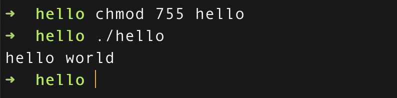

bin 和 package.json

https://docs.npmjs.com/cli/v7/configuring-npm/package-json

如果你发布的包中含有可执行文件，需要导入到路径PATH中，需要此命令。

bin项用来指定各个内部命令对应的可执行文件的位置。

## bin是一个对象

bin是一个对象（也可以是字符串），键名是‘自定义命令名’，值是命令文件,

如果全局安装这个包，npm会将这个文件链接到prefix/bin目录下面；

如果局部安装包，npm会将这个文件链接到你的项目根目录中./node_modules/.bin/目录下面；

~~~json
  "bin": {
    "pub": "bin/pub"
  },
~~~


## bin值是字符串

If you have a single executable, and its name should be the name of the package, then you can just supply it as a string. For example:

```json
{
  "name": "my-program",
  "version": "1.2.5",
  "bin": "./path/to/program"
}
```

等价于：

```json
{
  "name": "my-program",
  "version": "1.2.5",
  "bin": {
    "my-program": "./path/to/program"
  }
}
```

## 总结

当某个包配置了 `bin` 定义时，本地安装包的时候，会将bin命令指定的文件，自动软链到./node_modules/.bin/目录下。

然互，通过`npm`启动的脚本，会默认再把`node_modules/.bin`目录加到`PATH`环境变量中。

# bin file(s)：可执行脚本

Please make sure that your file(s) referenced in `bin` starts with `#!/usr/bin/env node`

bin文件必须使用**#!/usr/bin/env node**开头：

~~~js
#!/usr/bin/env node
const args = require('minimist')(process.argv.slice(2))
const {A: add, D: del, l: list, pub, h, help, s, d, f} = args
if (add) {
  require('../lib/addServer')()
}
if (del) {
  require('../lib/delServer')(del)
}
if (list) {
  require('../lib/showList')
}
if (s || d || f) {
  require('../lib/publish')(args)
}
if (help) {
  console.log('-A 添加一个服务器')
  console.log('-D 删除一个服务器')
  console.log('-l 查看已有的服务器')
  console.log('-h 要部署的服务器名')
  console.log('-s 部署有变更的文件到服务器')
  console.log('-d 部署当前目录下所有文件到服务器')
  console.log('-f 部署单个文件')
  console.log('--pub 执行部署')
  console.log('--help 查看帮助')
  console.log('--filter 要部署的文件的扩展名如: .js .css, 默认所有类型的文件')
  console.log('--ignore 忽略的文件的扩展名如: .js .css')
}

~~~

## 指定解释器

#!/usr/bin/env node

**脚本的第一行通常是指定解释器，即这个脚本必须通过什么解释器执行。**

这一行以`#!`字符开头，这个字符称为 Shebang，所以这一行就叫做 Shebang 行。**

*`#!/usr/bin/env NAME`这个语法的意思是，让 Shell 查找`$PATH`环境变量里面第一个匹配的`NAME`。如果你不知道某个命令的具体路径，或者希望兼容其他用户的机器，这样的写法就很有用。*


## 命令行参数


## demo: hello

### 新建简单的脚本文件hello

```bash
$ mkdir hello #创建一个文件夹
$ cd hello && touch hello #创建命令文件hello
```

### 脚本文件内容

```js
#!/usr/bin/env node
console.log('hello world');
```

### 执行权限和路径

此时，在终端直接执行命令`./hello`， 不能显示结果，报错如下：


原因：权限问题。脚本需要有执行权限，可以使用下面的命令，赋予脚本执行权限。

```bash
# 给所有用户执行权限
$ chmod +x hello

# 给所有用户读权限和执行权限
$ chmod +rx hello
# 或者
$ chmod 755 hello

# 只给脚本拥有者读权限和执行权限
$ chmod u+rx hello
$ chmod 700 hello
```

修改权限后，可以正确执行：




